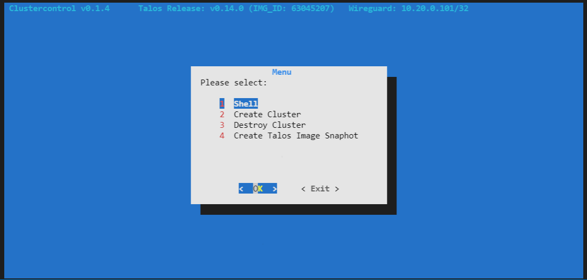

# Talos Production Cluster Bootstrap for Hetzner
This project is intended to offer an easy way to host a production ready k8s talos cluster on Hetzner Cloud.



- Easy going by just running a single command:
  `./clustercontrol.sh`
- The cluster is secured by 2 firewalls, only allowing wireguard as access endpoint, so no administration api endpoint is reachable from the public.
- The services provided by the cluster are published with a load balancer controlled by ingress-nginx and the `hetzner-cluster-controller-manager`


## How it works:
This project provides a local docker container containing all useful tools needed for the bootstrap and to administrate a talos k8s cluster from a windows os. It also features a wireguard-connection inside the container after the cluster was bootstrapped.

### Tools:
- terraform
- kubectl
- talosctl
- packer
- ansible
- kubediff
- helm
- kubectx
- kubens
- yq
- flux
- fluxctl
- wireguard

## Requirements
- Windows HOST OS (Not tested on any native linux machine. TODO!)
- WSL2

## Getting Started

* Create a .env file with your configuration.
* type `./clustercontrol.sh` to lauch the main menu. 

Please note: This may take some time on the initial run for docker to build everything up.
 
## Configuration

First, you need to create a project and a hcloud token in the hetzner cloud web console.

Please create a .env file with your settings:
```
HCLOUD_TOKEN=<your hcloud key>
CONTROLPLANE_SERVER_TYPE=cx21
AGENT_SERVER_TYPE=cx21
AGENT_COUNT=2
WIREGUARD_CLIENT_COUNT=5
LETS_ENCRYPT_ISSUER_EMAIL=admin@mysite.com
GITHUB_TOKEN=<your github PAT token>
```


## References
### Wireguard inside Docker in Windows:
https://centerorbit.medium.com/installing-wireguard-in-wsl-2-dd676520cb21
